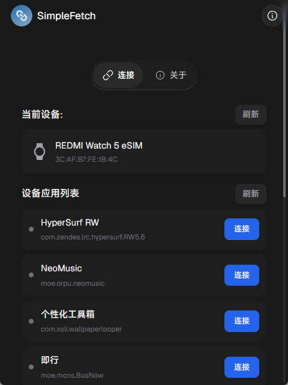
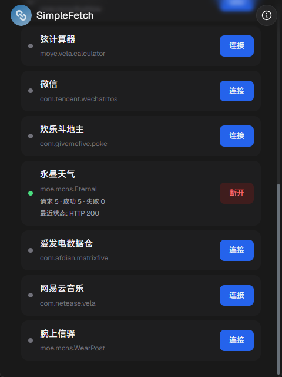
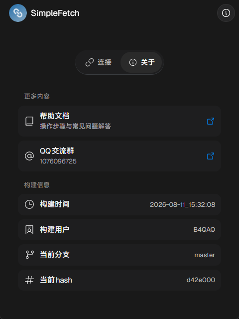

<p align="center">
  
</p>

<h1 align="center">SimpleFetch</h1>
<p align="center"><strong>让手表上的快应用，也能自由联网</strong></p>
<p align="center">AstroBox 网络桥接插件 · 代理 HTTP / SSE 请求</p>

<p align="center">
  <a href="#-特性">特性</a> •
  <a href="#-实机演示">实机演示</a> •
  <a href="#-快速开始">快速开始</a> •
  <a href="#-工作原理">工作原理</a> •
  <a href="#-项目结构">项目结构</a> •
  <a href="#-通信协议">通信协议</a>
</p>

---

## ✨ 特性

### 🌐 任意快应用可用
不绑定特定包名。任意接入 SimpleFetch 协议的快应用，按包名授权后即可通过本插件联网。

### 🔌 双向握手
插件或快应用任一方都可主动发起握手。收到 `SF_HANDSHAKE` 即回复 `SF_HANDSHAKE_ACK`，握手成功后快应用自动进入桥接模式。

### 💓 心跳保活
快应用每 10 秒发送一次 `SF_PING`，插件秒回 `SF_PONG`；长时间未收到心跳则主动关闭桥接，连接状态始终可靠。

### 📦 智能分片
响应体 ≤ 16KB 且为文本时单条直发；超过阈值自动整体 base64 编码后分片回传，快应用拼接解码即可。

### 🔄 SSE 流式转发
逐事件转发为 `SF_SSE_EVENT`，支持服务端正常结束（`SF_SSE_END`）、出错（`SF_SSE_ERROR`）和快应用主动关闭（`SF_CLOSE`）。

### 🛡️ 贴心容错
- 请求带 body 却缺少 `Content-Type` 时自动补全，与原生 `@system.fetch` 行为对齐
- gzip / deflate 自动解压
- 网络错误直接以中文描述返回：`请求超时`、`网络不可达`、`DNS解析失败`、`连接被拒绝`

---

## 📱 实机演示

<p align="center">
  
  
  
</p>

- **连接页**：当前设备卡片（设备名 + 蓝牙地址）与设备上的快应用列表
- **应用列表**：状态圆点实时反映连接情况（灰=未连接 / 黄=握手中 / 绿=已连接 / 红=失败），点击即可连接或断开
- **连接后**：绿色圆点展开请求统计与最近状态
- **关于页**：构建信息与帮助入口

---

## 🚀 快速开始

### 环境要求

- Rust toolchain（`wasm32-wasip2` target）
- Python 3（用于打包脚本）

### 初始化子模块

```bash
git submodule update --init --remote --recursive
```

### 安装构建目标

```bash
rustup target add wasm32-wasip2
```

### 构建

```bash
# 编译 wasm
cargo build --release

# 生成 dist 产物（manifest / 图标 / wasm）
python scripts/build_dist.py --release

# 同时打包成可安装的 .abp
python scripts/build_dist.py --release --package
```

产物输出到 `dist/`，发布同步到 `release/`。

---

## 🧩 工作原理

部分小米手环 / 手表设备本身不支持 `@system.fetch`，无法直接联网。SimpleFetch 在 AstroBox 上扮演「手机端」：

```
快应用  ──SF_REQUEST──▶  SimpleFetch 插件  ──真实 HTTP──▶  服务器
   ▲                                                        │
   └──────────────── SF_RESPONSE ◀──────────────────────────┘
```

1. 用户在连接页点击 `[连接]`（或快应用在「偏好设置 → 连接桥接网络」主动发起）；
2. 握手成功后，快应用设置 `global.NetworkStatus = 'bridge'`，所有 `fetch` 请求改走互联通道；
3. 插件收到 `SF_REQUEST` 后执行真实 HTTP 请求，并将结果按 `SF_RESPONSE` 格式回传；
4. 心跳维持连接，断开时自动回退网络状态。

手机端配套的快应用示例见 [ResonaUI-Example](https://github.com/B4QAQ/ResonaUI-Example)。

---

## 📁 项目结构

```
SimpleFetch-AstroBoxV2-Plugins/
├── src/
│   ├── lib.rs              # 插件入口、事件分发、状态卡片
│   ├── logger.rs           # 日志（控制台 + 文件）
│   └── ui/
│       ├── mod.rs          # 模块导出
│       ├── state.rs        # 全局状态（连接状态机、统计、心跳追踪）
│       ├── persist.rs      # 配置持久化
│       ├── build.rs        # UI 构建（连接页 / 关于页）
│       ├── event_handler.rs# SF 协议、握手、设备/应用管理、UI 事件
│       ├── api_client.rs   # HTTP / SSE 执行层（分片、解压）
│       └── icons.rs        # SVG 图标
├── wit/                    # AstroBox 主机接口定义
├── scripts/build_dist.py   # 构建打包脚本
├── manifest.json           # 插件清单
└── SimpleFetch-手机端接入文档.md  # 协议接入文档
```

---

## 📡 通信协议

所有消息为 JSON，顶层固定 `{ type, status, data }`。

| 方向 | type | 说明 |
|------|------|------|
| 双向 | `SF_HANDSHAKE` / `SF_HANDSHAKE_ACK` | 握手 / 确认 |
| 快应用 → 插件 | `SF_PING` | 心跳 |
| 插件 → 快应用 | `SF_PONG` | 心跳回复 |
| 插件 → 快应用 | `SF_CLOSE_BRIDGE` | 关闭桥接 |
| 快应用 → 插件 | `SF_REQUEST` | 网络请求（普通或 SSE） |
| 插件 → 快应用 | `SF_RESPONSE` | 普通响应（含分片） |
| 插件 → 快应用 | `SF_SSE_EVENT` / `SF_SSE_END` / `SF_SSE_ERROR` | SSE 事件 / 结束 / 出错 |
| 快应用 → 插件 | `SF_CLOSE` | 关闭某个 SSE |

### 握手

```jsonc
// 发起方
{ "type": "SF_HANDSHAKE", "data": {} }
// 接收方
{ "type": "SF_HANDSHAKE_ACK", "status": "OK", "data": {} }
```

### 普通请求与响应

```jsonc
// 快应用 → 插件
{
  "type": "SF_REQUEST",
  "data": {
    "id": "sf_1",
    "url": "https://api.example.com/data",
    "method": "POST",
    "headers": { "Content-Type": "application/json" },
    "body": "{\"key\":\"value\"}",
    "sse": false,
    "timeout": 10000
  }
}

// 插件 → 快应用（小数据，无分片）
{
  "type": "SF_RESPONSE",
  "status": "OK",
  "data": {
    "id": "sf_1",
    "statusCode": 200,
    "headers": { "Content-Type": "application/json" },
    "body": "{\"result\":\"ok\"}",
    "chunk": 0,
    "totalChunks": 0
  }
}
```

完整协议规范见 [`SimpleFetch-手机端接入文档.md`](SimpleFetch-手机端接入文档.md)。

---

## 🛠 技术栈

- **Rust** + `wit-bindgen` —— Component Model 异步绑定
- **WASI HTTP** —— 真实 HTTP / SSE 请求执行
- **flate2** —— gzip / deflate 自动解压
- **base64** —— 大响应体编码分片

---

## 🤝 参与贡献

1. Fork 本仓库
2. 创建分支：`git checkout -b feat/your-feature`
3. 提交更改：`git commit -m 'feat: add your feature'`
4. 推送分支：`git push origin feat/your-feature`
5. 提交 Pull Request

---

## 📄 许可证

本项目采用 [MIT](LICENSE) 许可证。

---

<p align="center">
  <strong>SimpleFetch</strong> - 为 Vela / 快应用生态而作
  <br>
  <sub>Built with ❤️ for AstroBox</sub>
</p>
